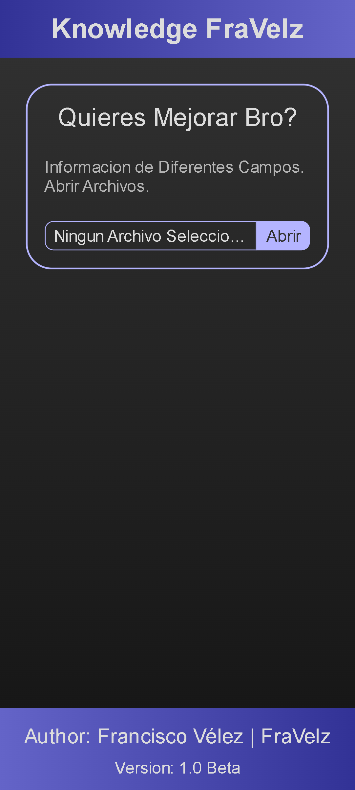

# Web-Knowledge

#5 Project on the web using Html, CSS, Javascript. Made to view notes from the browser.

I save notes of some type of information in .md (markdown) and view them with the website.

If it still does not work, it is because the .md file has obsolete markings for this website, below are the styles it allows:
* Titles (#) and subtitles (##).
* Ordered Lists (*) and Numeric Lists (1.).
* normal text.
* comments(> ).

**Image 1**

> Author: Francisco Vélez | FraVelz